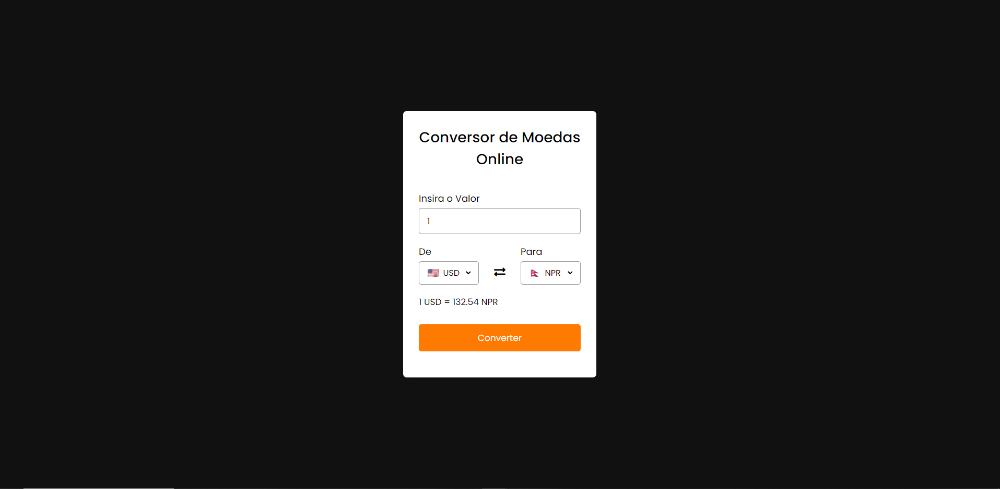

# Conversor-de-Moedas-Online

Conversor de Moedas Online, com 58 paises para se realizar a conversão o projeto utiliza a API ExchangeRate e API Flagcdn(Imagens das bandeiras dos paises) e JS para o tratamento e exibição dos dados.

# Links de acesso as API's ExchangeRate e Flagcdn:

* https://www.exchangerate-api.com/
* https://flagcdn.com/